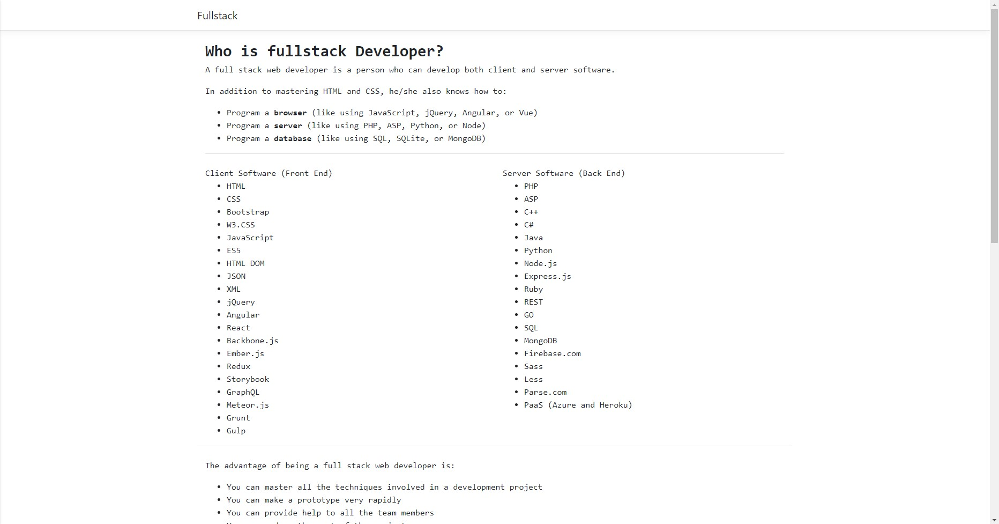
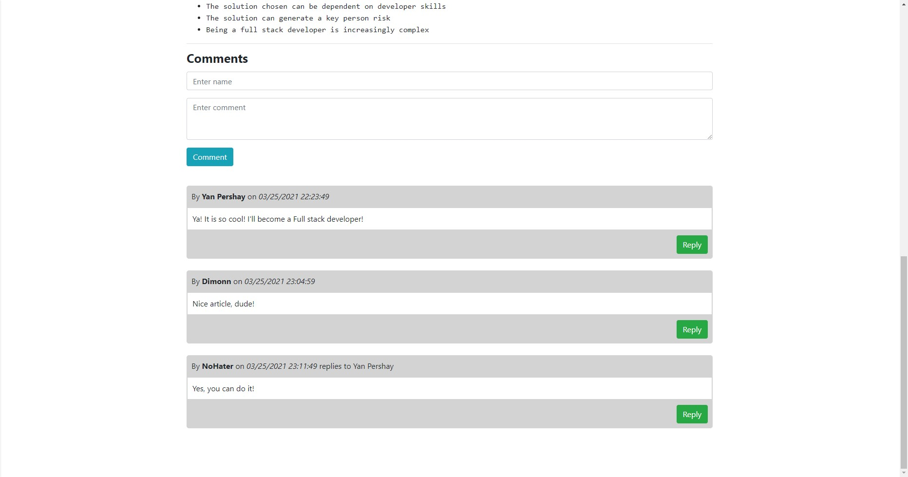

# Article & Comments

Simple project with using ASP.NET Core MVC, HTML/CSS, JS, jQuery, AJAX, local SQL DB.
Singlepage web-app with article and simple comments system. 

Article part:

 

It is possible to reply to comments. In this case, it is indicated to whom the answer is addressed. Comments part:

 

